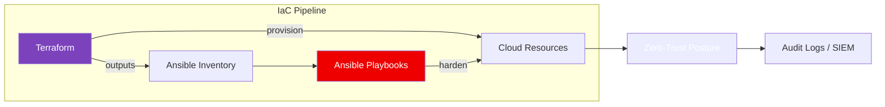

<div align="center">

# TerraStack

**Infrastructure-as-Code templates for Zero-Trust deployments on AWS / GCP / on-prem.**

[](LICENSE)
[](https://www.terraform.io/)
[](https://www.ansible.com/)
[]()
[](https://github.com/franamaro-dev/TerraStack/actions)

</div>

---

## What it solves

Most starter Terraform repos hand you a VPC and a public EC2. TerraStack starts from the **opposite assumption**: nothing is trusted by default.

It bundles a set of opinionated modules to bootstrap an environment that is **private-by-default, audit-first, and reproducible** — with Ansible doing the post-provision hardening that Terraform doesn't cover.

---

## Architecture



---

## Principles

- **Deny by default**: every security group, firewall rule and IAM policy starts at `deny *`.
- **Least privilege**: roles scoped per-service, no wildcard `*` actions.
- **No public ingress** without an explicit, justified module flag.
- **State remote, encrypted, locked**: S3 + DynamoDB / GCS + locks.
- **Immutable infrastructure**: redeploy, don't `ssh + patch`.
- **CI validation**: `terraform fmt` + `terraform validate` + `tflint` + `tfsec` on every PR.

---

## Repository layout

```
.
├── terraform/
│   ├── modules/        # reusable, versioned modules
│   ├── envs/           # per-environment composition (dev / staging / prod)
│   └── backend.tf      # remote state config
├── ansible/
│   ├── playbooks/      # hardening, post-provision config
│   ├── roles/          # CIS-aligned roles
│   └── inventory/      # dynamic inventory (terraform output → ansible)
└── .github/workflows/  # validate_iac.yml
```

---

## Quickstart

```bash
git clone https://github.com/franamaro-dev/TerraStack.git
cd TerraStack/terraform/envs/dev
terraform init
terraform plan -out tfplan
terraform apply tfplan
```

Then run hardening:

```bash
cd ../../../ansible
ansible-playbook -i inventory/dev playbooks/harden.yml
```

---

## Tech stack

| Layer | Tool |
|-------|------|
| Provisioning | Terraform (HCL) |
| Configuration | Ansible (YAML) |
| State | S3 / GCS + lock table |
| Validation | `tflint`, `tfsec`, `ansible-lint` |
| CI | GitHub Actions |

---

## Roadmap

- [ ] OpenTofu compatibility check
- [ ] Module: zero-trust VPC peering
- [ ] Module: SSO + SCIM for cloud accounts
- [ ] OPA / Conftest policies for compliance gates
- [ ] Cost guardrails (Infracost)

---

## License

[MIT](LICENSE) © Francisco Amaro Prieto

---

<div align="center">

Built by [Francisco Amaro](https://github.com/franamaro-dev) — Backend Engineer & SOC L1 Analyst
[LinkedIn](https://linkedin.com/in/franamaro) · [Email](mailto:franamaroprieto@gmail.com)

</div>
